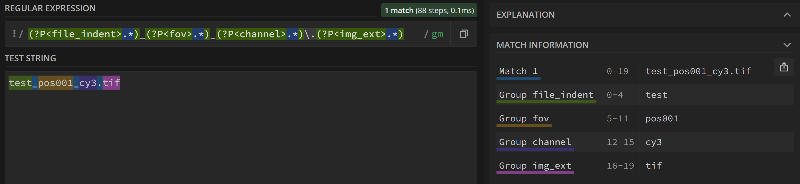

# Data specifications

Here we describe how data has to be

* **... organized**: data processing can be done for a batch of images, but for this data has to be organized as specified below.
* **...named**: FISH-quant extracts important information from the file-names. This requires a certain naming convention described below. 

## Demo data

Already processed demo data (in 3D) can be downloaded from [**Dropbox**](https://www.dropbox.com/s/ep1lwxvnfofuaot/fq-imjoy-demo.zip?dl=0). With these data, you can verify if the different analysis steps are properly executed.

A smaller (2D) data-set is directly available from within the FISH-quant interface, when you press on the button `Get zipped (demo) data`. You can also download it from  [**Dropbox**](https://www.dropbox.com/s/kda9rgfs3tb1evv/fq-imjoy-tutorial.zip?dl=0)

## Organization

We strongly recommend the following data-organization on which this workflow has been tested.

The same data organization is also used in the package to perform [cell and nuclear segmentation](https://github.com/fish-quant/segmentation/). This permits to easily combine these workflows.

1. Images are store as single-channel multi-z-stack tif files, e.g on tif per position and channel. If your data are not single-channel, see the section on how to split channels with [Fiji](fiji-split-channels.md).
2. All raw 3D images are stored in a folder `acquisition`
3. All analysis results are stored in subfolder `analysis`, where each analysis step has a separate subfolder. This folder can be automatically created as explained in the section about data import.

The organization of the provided test data is the following

``` bash
├─ fq-imjoy-demo/
│  ├─ acquisition                          # Folder with raw images
│  │  ├─ test_pos001_cy3.tif
│  │  ├─ test_pos001_dapi.tif
│  │  ├─ test_pos002_cy3.tif
│  │  ├─ test_pos002_dapi.tif
│  ├─ analysis                             # Folder with all analysis results
│  │  ├─ segmentation-input                    # Folder with input for segmentation
│  │  │  ├─  ....
│  │  ├─ segmentation-results                  # Folder with segmentation results 
│  │  │  ├─  ....
│  │  ├─ spot-detection                         # FQ detection results
│  │  │  ├─ test_pos001_cy3__settings.json      # Settings files
│  │  │  ├─ test_pos001_cy3__spots.csv          # Spot detection results 

```

## Naming convention & regular expression

FISH-quant will extract important information about the images, such as the field of view or the imaged channel, directly from the file-names. 
For this, we use a **regular expression**. A regular expression is used specifies search patterns in text. In our case, we use such an expression
to analyze the image file-name and extract important information about the image, such as what channel it is.  

Regular expression look a bit complicated, but they provide a lot of flexibility and allow us to not impose a strict naming scheme, but extract
the relevant information with these expressions and thus process images with with different naming conventions.

The filenames **MUST** contain an identifier for:

* experiment (**`file_ident`**): string specifying an experiment, e.g. what gene was imaged. If multiple channel are imaged, this string **has** to be identical for all images.
* field of view (**`fov`**): what position was acquired. As above, has to be identical for multi-channel images.
* channel (**`channel`**): which channel was imaged.
* image extension **(`img_ext`**): image extension, e.g. `tif`. Only images with this extension will be loaded.

These informations are extracted by using **regular expression and capture groups**. Here, we only explain some of the basic concepts, there are many 
excellent ressources on the web to learn and test your own regular expression, such as [https://regex101.com/](https://regex101.com/).

As an example, we use the **default naming scheme** from the examples above. Here, the different identifies are separated by `_` and ordered as `<file_ident>_<fov>_<channel>.<img_ext>`:

``` bash
       fov      img_ext
        |          |
  test_pos001_cy3.tif
    |          |
file_ident   channel
```

We can now define a regular expression to analyze such a string, and extract the different subgroups. For this, you essentially write a string with fixed elements, and placeholders (tokens)
that match you file-name. In order to analyze this file-name, we only need the following elements

* `.` matches any character (except for line terminators)
* `*` matches the previous token between zero and unlimited times.
* `\.` matches the character `.` once.
* `_` matches the character `_` once.
* (?P<fov>.*) is a named capture group (name `fov`), which allows to extract the part that matches to this subgroup.

With this, we can write the following regular expression

```regexp
(?P<file_ident>.*)_(?P<fov>.*)_(?P<channel>.*)\.(?P<img_ext>.*)
```

This allows to analyze a given filename, e.g. `test_pos001_cy3.tif` and extract the different subgroups

{: style="width:500px"}

In this example, the `fov` capture group corresponds to `pos001'. If you would like to extract only the number and not
the string `pos`, you could explicitly add this string to the regular expression outside of the capture group (`_pos(?P<fov>.*)`):

```regexp
(?P<file_indent>.*)_pos(?P<fov>.*)_(?P<channel>.*)\.(?P<img_ext>.*)
```

Now, the capture group only contains `001`. To get a better feeling for this, you can also play around
on [https://regex101.com/](https://regex101.com/)).

__IMPORTANT__: if you have multiple images, e.g. different channels, of the same field of view, and you want to load them at the same
time into the interfacem you **have** to guarantee that the **fov** and **file_ident** are identical for these images. If they are not, 
the images will not be matched, and the images will not show up. Construct your regular expression accordingly!
