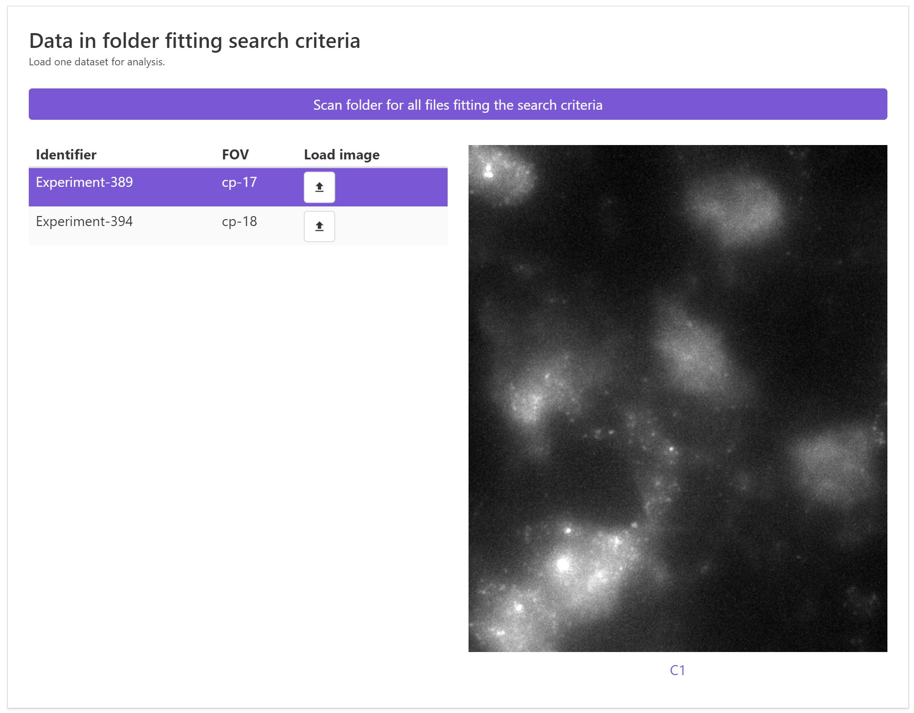

# Data
In the tab, you can define where your data is located, its naming convention, and load selected images
to test the analysis.

## Typical workflow
1. Copy & past the folder containing your data into the field `Folder with data`
2. The field `Folder to save data`, permits to determine where you data is stored. Two different options exist
    1. The default string `acquisition>>analysis` indicates that not a complete path is provided,
       but that a string in the provided data folder will be replaced. More specifically, the string `acquisition` 
       will be replaced by `analysis`. The obtained path name will then be used to store the detection results, in
       a newly created subfolder `spot detection`
    2. If you define a path name, then this path will be used to store the data. 
3. Define the naming convention of your files with a regular expression. For more details, see
   the dedicated [section](data.md#naming-convention).
4. Pixel-size in XZ, and Z-spacing. Both values are provided in nmm.
5. Specify channel(s) to be analyzed. Here you have to specify a name you want to use for a channel, e.g. `fish`,
   and the string (as defined in the regular expression) for the channel in the file-name
6. Once all parameters are defined, you can press `Scan folder ...`. This will scan the folder for all images
    satisfying the selection criteria. Only images that satisfy all criteria, e.g. they must have all specified channels, 
    will be listed. 
7. A list in the lower part of the interface will then be populated. You can load an image by clicking on the arrow symbol. 
    This will load for a given position all specified channels.        

    {: style="width:500px"}

## Trouble shooting

### No images were found
This means that the specified criteria did not provide any positive hits. This can have several reasons

* **Regular expression is wrong**. You can test your regular expression by pressing the button `Test regexp`. 
    This will open a new window where you can test your expression on your file-names. The first line
    will be automatically populated with your regular expression, as a test-string you can specify 
    your file-name. If the regular expression is correct, you should a populated list under `Match catpures`,
    where the identified parts of the file-name are listed.

    {: style="width:500px"}
   
