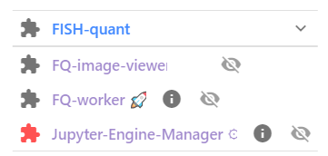
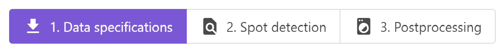
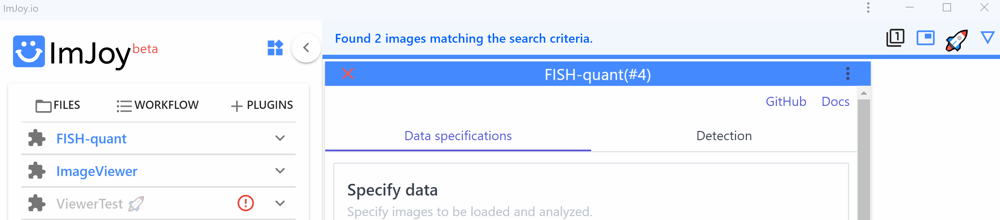
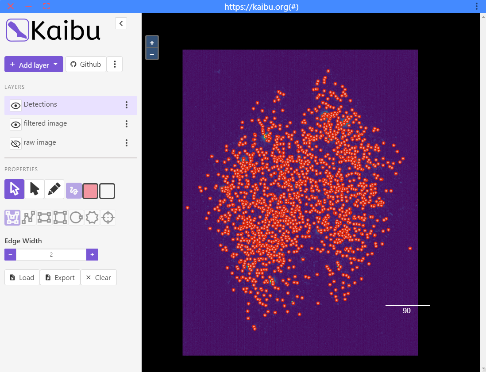

# Overview 

## Installation

* If you use FISH-quant for **the first time**, you can install it with <a href="https://imjoy.io/#/app?w=fq-main&plugin=fish-quant/fq-imjoy:FISH-QUANT@stable&upgrade=1" target="_blank">**this link.**</a> 
    - First time installation can take a few minutes, since several Python libraries are installed.
    - More details about installing plugins are [here](imjoy-overview.md/#installing-plugins)).

* Once installed, the plugin will be saved in the  **workspace `fq-main`** as described [here](imjoy-overview.md#opening-a-workspace).  

In the ImJoy app, you will find the **main plugin** `FISH-QUANT`, as wells as several helper plugins.

!!! info "The main important plugin is `FISH-QUANT`."

    This **Python plugin** performs the actual data analysis and 
    runs on a Juypter engine, as described in the [installation instructions](imjoy-overview.md#connect-jupyter-engine). 
    
    So when using FISH-QUANT, you have to connect ImJoy to a Jupyter engine and make sure that 
    the FISH-QUANT is running on this engine.  

    {: style="width:200px"}

## Starting FISH-QUANT

After connecting ImJoy to a Jupyter engine, press on the FISH-QUANT plugin name. This will open an interface with different tabs, that 
allow to control the main workflows. Controls will only be enabled, when all necessary parameters
are defined.

{: style="width:400px"}

1. **Data specifications**: allows to specify how the data should be read, and to load images for analysis.
2. **Spot Detection**: perform spot detection on individual images, and batch analysis images in one folder.
3. **Postprocessing**: analyze spot detection results, e.g. assign spots counts to cell segmentation results.

### Maximize ImJoy

To maximize the available space in the ImJoy window, you can do two things:

1. Start ImJoy as a **Chrome App**. This will detach ImJoy from Chrome and show it as a separate application with its own icon in the taskbar

    {: style="width:200px"}

2. **Minimize the plugin side-bar** once you launched FISH-quant.

    {: style="width:600px"}

## Kaibu Image viewer
Images and analysis results are displayed with [Kaibu](https://kaibu.org/#/about).

{: style="width:500px"}

### Layers

A central concept in Kaibu are **layers**. Each layer can contain different content (images, spot detection results, ...).

* The visibility of a layer can be turned on and off by clicking on the eye symbol.
* When clicking on a layer a content specific menu is show, e.g. to change the contrast of an image.

### Inspection of your image

Once your image is opend, you can interact with your image.

__Navigate__:

* **Zoom** either with the dedicated buttons, or with the mouse-wheel, or gestures on touch-screens.
* **Pan** with pressed mouse button, or corresponding gestures on a touch screen.

In order to see pixel values of an image layer, minimize the Kaibu side-bar.

* When **hoovering** over a pixel you will see relevant information such as its position and importantly intensity value.

__Appearance__:
For an image layer, you can  

* Change the **lookup table**.
* Change the **contrast of the image**.
