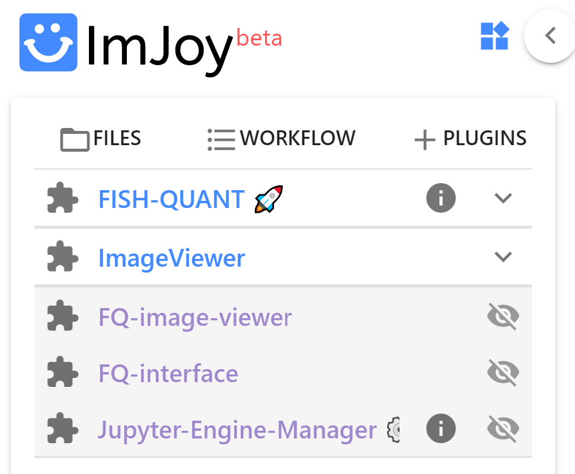

# Overview

Installing the FISH-quant plugin, requires that you have a **Plugin engine** installed, and ImJoy
connected to it as explained  [here](imjoy-installation.md#).

## Plugin installation

If you use the FISH-quant plugin for **the first time**, you can install it with 
<a href="https://imjoy.io/#/app?w=fq-main&plugin=fish-quant/fq-imjoy:FISH-QUANT@stable&upgrade=1" target="_blank">**this link.**</a>. 

Pressing this link, will open a new instance of ImJoy and display the install dialog. Simply press `Install`. More details about 
installing plugins are [here](imjoy-overview.md/#installing-plugins)).

This installation can take a while since all necessary libraries are installed.

These plugins are saved in the  **workspace `fq-main`**. If you open ImJoy again, you can select this workspace and you will find your plugins.

Once installed, you will find the **main plugin** `FISH-QUANT`, as wells as several helper plugins. 

!!! info "`FISH-QUANT`: the main plugin."

    This **Python plugin** performs the actual data analysis and 
    runs on a Juypter engine, as described in the [installation instructions](imjoy-overview.md#connect-jupyter-engine). 
    
    So when using FISH-QUANT, you have to connect ImJoy to a Jupyter engine and make sure that 
    the FISH-QUANT is running on this engine.  

    {: style="width:200px"}

### Choosing plugin engine

ImJoy can be connected to multiple engines, e.g. to run different analysis tasks (RNA detection and cell segmentation). 
If you have only one engine connected to ImJoy, plugins will be **automatically connected** to this engine. 
 
If yoy have multiple engines, you have to choose on which engine the plugin should be running by pressing on the 
puzzle symbol and choosing the appropriate engine.

## Starting FISH-QUANT

After connecting ImJoy to a Jupyter engine, press on the FISH-QUANT plugin name. This will open an interface with different tabs, that 
allow to control the main workflows. Controls will only be enabled, when all necessary parameters
are defined.

{: style="width:400px"}

1. **Data specifications**: allows to specify how the data should be read, and to load images for analysis.
2. **Spot Detection**: perform spot detection on individual images, and batch analysis images in one folder.
3. **Postprocessing**: analyze spot detection results, e.g. assign spots counts to cell segmentation results.

### Maximize ImJoy

To maximize the available space in the ImJoy window, you can do two things:

1. Start ImJoy as a **Chrome App**. This will detach ImJoy from Chrome and show it as a separate application with its own icon in the taskbar

    {: style="width:200px"}

2. **Minimize the plugin side-bar** once you launched FISH-quant.

    {: style="width:600px"}

## Kaibu Image viewer

Images and analysis results are displayed with [Kaibu](https://kaibu.org/#/about).

{: style="width:500px"}

### Layers

A central concept in Kaibu are **layers**. Each layer can contain different content (images, spot detection results, ...).

* The visibility of a layer can be turned on and off by clicking on the eye symbol.
* When clicking on a layer a content specific menu is show, e.g. to change the contrast of an image.

### Inspection of your image

Once your image is opend, you can interact with your image.

__Navigate__:

* **Zoom** either with the dedicated buttons, or with the mouse-wheel, or gestures on touch-screens.
* **Pan** with pressed mouse button, or corresponding gestures on a touch screen.

In order to see pixel values of an image layer, minimize the Kaibu side-bar.

* When **hoovering** over a pixel you will see relevant information such as its position and importantly intensity value.

__Appearance__:
For an image layer, you can  

* Change the **lookup table**.
* Change the **contrast of the image**.
