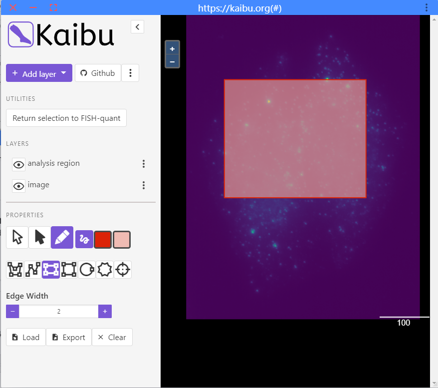
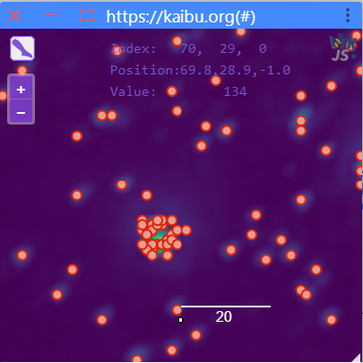
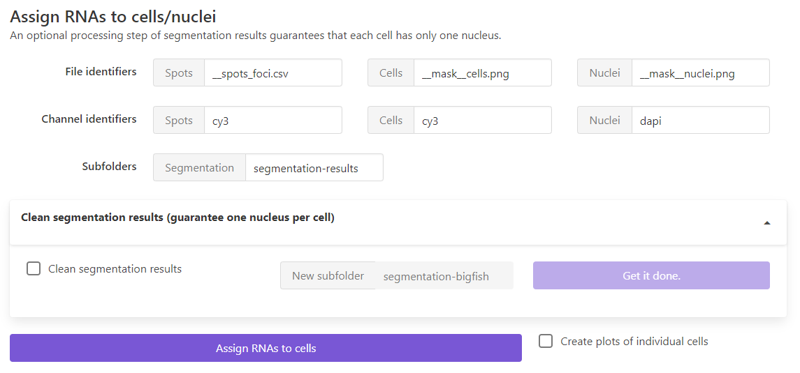
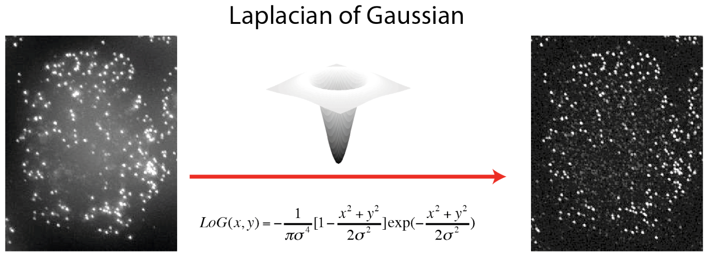
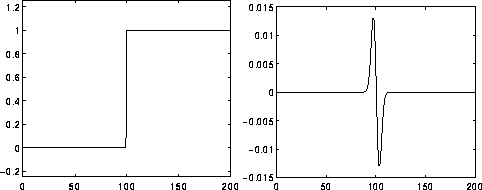
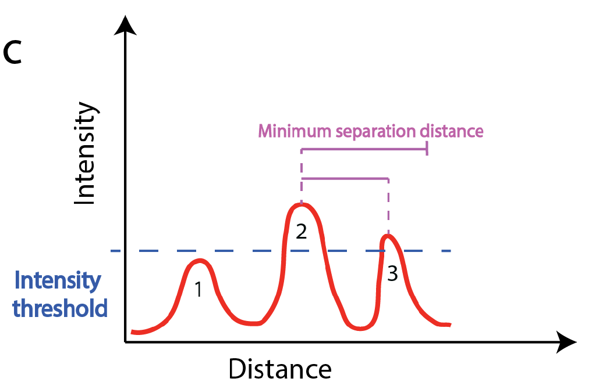
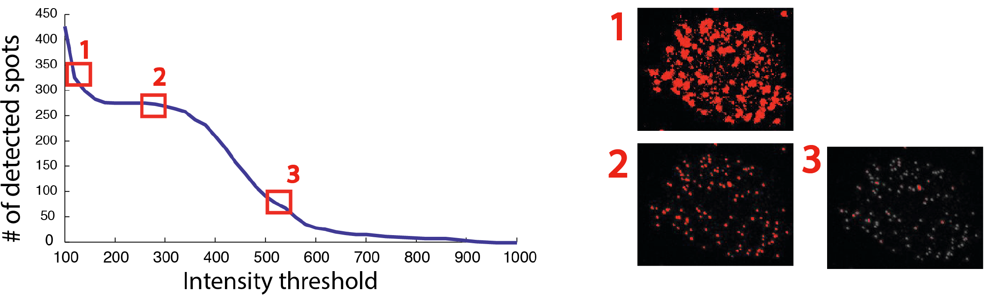

# Spot detection

## Overview

Spot detection is performed with a standard spot detection approach on either 2D or 3D images. For more details and some
benchmarking, we refer to our paper ([Tsanov et al., NAR, 2016](https://academic.oup.com/nar/article/44/22/e165/2691336)).

1. Images are **filtered** with a Laplacian of Gaussian (Log) filter. This removes background and enhances local contrast of small spots.
2. Spots are **detected** with a local maximum approach. As the name implies, spots are considered if they are above a user-defined threshold and further away from another spot than a user-defined distance.

In this tab, the user will specify

* Parameters of the LoG filter
* Parameter of the local maximum detection: minimum distance and intensity threshold
* Apply this detection either to one image, or all images in the specified data folder.

## Workflow

### Select channel and region

1. Select which channel should be analyzed.
2. [Optional]: to speed up an exploratory analysis, you can **restrict the analysis to a smaller region of the image**.
      1. Press `Select smaller region to test analysis`
      2. This will open a new window where you see the filtered image.
      3. A rectangular selection is preselected. You can highlight a region where you want to test the analysis. Draw only one region!
      4. Once you are satisfied with the selection, you can press the button `Return selection to FISH-quant`.
      5. You can then close the window.

      {: style="width:450px"}

### Filter image

Here you can change the paramaters of the LoG (Laplacian of Gaussian filter. More details about the LoG filter can be found in the background section below.

* **Double click** on the image will show it in a separate interface for inspection. This interface can not be resized and has to be closed before continuing the analysis. See dedicate for more details on how to use the  [**image viewer**](fq-overview.md#image-viewer).
* To show the image in a interface that can be resized and kept open, press the button button `Show`.
* You can **save** filtered image on the disk with the button `Save`. It will saved in a subfolder `filtered_image`.
* The filter size will be stored and reused when you launch ImJoy the next time.

### Detection threshold

Spot detection is performed with a local maximum detection on the filtered image (more details below). 

1. This detection requires setting two paramters:

      1. **Minimum distance** two spots have to be separated in order to be detected (default 2 pixels)

      2. **Minimum intensity** a spot must have. To better establish this value, you can specify a range of detection tresholds that will be tested in the pull-down menu.

          {: style="width:350px"}

          To properly set this range, it can be useful to inspect the filtered image. A good starting point is:

          * a **minimum value** somewhat dimmer than the dimmest spot, and brighter than the typical background.  
          * a **maximum value** brighter than the brightest spot.

2. Pressing `Test thresholds` will calculate for each threshold the number
   of detected spots and show this as a graph.
     * This plot is interactive. When you hoover over it
       it will show you the corresponding values, you can also zoom, and save it as an image.
     * When you press on it, the respective threshold will be set
       in the field next to the button `Apply detection threshold`

    {: style="width:350px"}

3. To apply the threshold, press the button `Apply detection threshold`. Once finished, 
   the detection results will be shown in Kaibu. Here you can toggle the spot detection results, 
   show either the raw and filtered image, and judge the quality of the spot detection. 

4. You can then analyze either
    * The **currently selected image** with the button `Analyze current image`. If filtering was performed on the full size image, the image will not be filtered again.

    This will also automatically save the plot with the tested thresholds in addition to the results files with the suffix `__detection_tests.png`.
    * All **images in the folder** with the button `Launch batch processing`
    For each analysed images, results files will be created in the specified results folder. 
    More details on the results files can be found below.

## Decompositon of dense areas and cluster detection

The implemented RNA detection approach works well for reasonably separated spots. However, it fails once
spots are too close or even overlapping, e.g. in transcription sites. Such denser areas are usually only 
detected once and lead thus to an underdetection.

For such cases, we implemented an additional module that allows to 
1. Decompose such dense areas, i.e. we attempt to place indidivual RNA molecules to reproduce the signal.
2. Cluster calling. We use a spatial cluster approach (DBscan), where you can specify under which criteria 
   you consider an accumulation a cluster. 

### Decompose such dense areas

The basic idea is simple

1. From all detections, we calculated a reference spots. This is done by calculating the median image, which is then fit with a Gaussian function (A Gaussian function
  describes rather accurately a spot like signal)
2. We then identify all regions that appear to be brighter or bigger than this median reference spot. 
3. For each candidate region, we implemented an iterative approach 
   to create an image that matches best the identified candidate regions. Starting with an empty image, 
   we compare at each iteration the simulated image with the actual image, and place a reference spot 
   at the location with the maximum difference. Iteration is stopped once the the images match best. 

You can controll this behavior with several parameters

- `psf_xy` and `psf_z`: estimated size of the spots in nanometer. Used to determine cropping size around reference spot.

**Advanced**

- `alpha`: Intensity percentile used to compute the reference spots. Value betweon 0 and 1. Higher values mean that the reference spot is brighter, and fewer spots will be needed to describe the dense region. Default is 0.5, meaning the reference spot considered is the median spot.
- `beta`: Multiplicative factor for the intensity threshold of a dense region. Calculated from the max intensity of the reference spots. Default is 1. Higher values will results in a more restrictive selection of candidate regions. 

When clicking on the button `Decompose dense regions`, the specified settings will be applied. A Kaibu window image will be shown
with the decomposed results. You can also zoom in to inspect the results further.

{: style="width:300px"}

For more information see the detailed documentation [here](https://big-fish.readthedocs.io/en/stable/detection/dense.html?highlight=decompose_cluster#bigfish.detection.decompose_dense).

### Cluster calling

Once the dense areas are decomposed in individual RNA molecules, you can specify what you consider to be a cluster.
For this, you can set two parameters

1. `Min. number of spots`: what's the minimum number of RNAs a cluster has to contain
2. `Max. distance [nm]`: what's the maximum distance two spots can be separated and still be considered to belong together.

Pressing the button `Call clusters` will shown an image wiht the individual RNAs and the identified clusters. The number next 
to each cluster indicates how many RNAs are found there.  

## Processing of one or several images

Once you are satisfied with the parameters, you can either process one image (`Analyse current image`) or all 
images that were found in your acquisition folder (`Launch batch processing`).

For each analyzed image, several files will be created and stored under the orginal image name with a suffix

### Results for standard spot detection

* **`__analysis_details.json`**: file with details about the analysis: all settings, and some basic image properties.
* **`___spots.csv`**: csv file with the position of all detected spots (in pixel).

Further, a folder `plots_detection` will be created containing the spot detection results for each image.

* **`__detection.png`**: 2d (filtered) image with detected spots.

### Results for cluster calling

* **`__foci.csv`**: file with positions of all clusters, a unique index, and how many RNAs they contain.
* **`___spots_foci.csv`**: csv file with the position of all detected spots (in pixel) and to which cluster they belong (0=none).

Further, a folder `plots_foci` will be created containing the spot detection results for each imag  

## Assign RNA detection results to cells and nuclei

The RNA detection is performed on the entire image. If you want to obtained results for individual cells and nuclei, 
we provide a dedicated processing module under `Post-processing`.

You first need to segment your cells/nuclei, we provide a dedicated deep-learning based tool for this, which is described [**here**](https://fq-segmentation.readthedocs.io/en/latest/). But you can also use your own tools if you prefer. 

The results, however, segmentation results have to follow **certain requirements**:

- Segmentation results have to be stored in a dedicated subfolder in the analysis folder, usually called `segmentation-results`
- Segmentations are stored as a label image (png), where each object is a filled mask with a constant value. 0 is reserved for background. 
- These masks are identified with the name of the image, followed by a suffix, e.g. `__mask__cells.png`

Lastly, in order to know that a cell and a nucleus belong together, they have to have the same constant value. If this is not the case, 
we provide a little processing script that goes over all cells, looks for the corresponding nucleus, gives them the same index, and stores
the results in new folder. 

Once you specified all parameters permitting to identify the spot detection and segmentation results, you can press on `Assign RNAs to cells`. 
This will create a new folder `results_per_fov`, where several files are created for each image

- `_SPOTS_SUMMARY.csv`: containes RNA counts for each cell (how many total, in cytoplasm or nuclei, in foci transcription sites)
- if you enable the option `Create plots ...`, a folder with the name of the image will be created containing a plot for each cell. 

### Parameters

{: style="width:600px"}

**File identifiers**: suffix to determine which files will be considered

- `Spots`: this can either be the detection results of individual spots `__spots.csv` or after cluster detection `__spots_foci.csv`
-  `Cells`, `Nuclei: what's the suffix used to save the label images for cells and nuclei.

**Channel identifiers**: unique string in the file-name for the different channels containing the detected spots and were used to
segment cells and nuclei

**Subfolder**: folder in the analysis folder containing the segmentation results. 

If you want to clean the segmentation results and assign nuclei to cells, you can enable the dropdown menu, and specify the new
subfolder were the cleaned masks should be stored. 

## Some background

### LoG filter

!!! abstract "Why a LoG filter? How to set the sigma?"
    The LoG filter allows to easier detec the spots by enhancing their signal. The sigmas are the
    **scale of the filter** and should be set to the typical size of spots in the image.

{: style="width:350px"}

A LoG filter is a standard filter that is routinely used to **detect rapid change (edges) in images**.

It computes the second derivatives of an image, measuring the rate at which the first derivatives change.
This means that in areas where the image has a constant intensity (i.e. where the first derivative is zero), the LoG response will be zero. However, in the vicinity of an intensity change in intensity the LoG response will be positive on the darker side, and negative on the lighter side. This means that at a reasonably sharp edge between two regions of uniform but different intensities, the LoG response will be:

{: style="width:450px"}

Image from https://homepages.inf.ed.ac.uk/rbf/HIPR2/log.htm

The filtered image is computed **with a convolution with the LoG function**. This function has one parameter: sigma. The value **`sigma`** are the standard deviations of the Gaussian filter for each dimension. It defines the **scale of the filter**, i.e. it corresponds to the typical size of the object that should be detected.

!!! info "Implementation"
    We use the LoG filter implementation of **scipy**: [`scipy.ndimage.gaussian_laplace`](https://docs.scipy.org/doc/scipy/reference/generated/scipy.ndimage.gaussian_laplace.html)

### Local maximum detection

This method relies on the detection of spots as **local maxima**, which are
defined by two criteria.

1. They have to be brighter than a user defined threshold.
2. They are brighter than all other spots in a user-defined window surrounding them. This window size can
play a critical role when working with dense images. For instance, a bright spot might not be
detected because an even bright spot is found in close proximity, e.g in the example below only spot 2 is detected even if spot 3 is above the set intensity threshold. Setting this value rather high, will yield a detection of spatially sparse spots. This can be
useful, if not many spots are to be detected. In contrast, a low value, will permit to detect
close spots, which can be useful for denser signals.

{: style="width:400px"}

One crucial aspect  is **determining the optimal intensity threshold**. For smFISH
image analysis, no fully automated method to determine this threshold has been proposed so far, but a simple sequential test of different thresholds provides a good
guideline. FISH-quants tests a number of intensity thresholds and records the number of
detected spots. The curve displaying number of detected spots as a function of the intensity threshold,
has very low values for high thresholds (under-detection, region 3 below), and very high values for low thresholds
(over-detection, region 1 below). For the intensity values corresponding to real mRNA molecules often a characteristic plateau can be seen (region 2 below). This intensity value is usually constant for a given
experiment, but may change from experiment to experiment even for the same target gene due to
variability in the smFISH experiments.

{: style="width:600px"}
