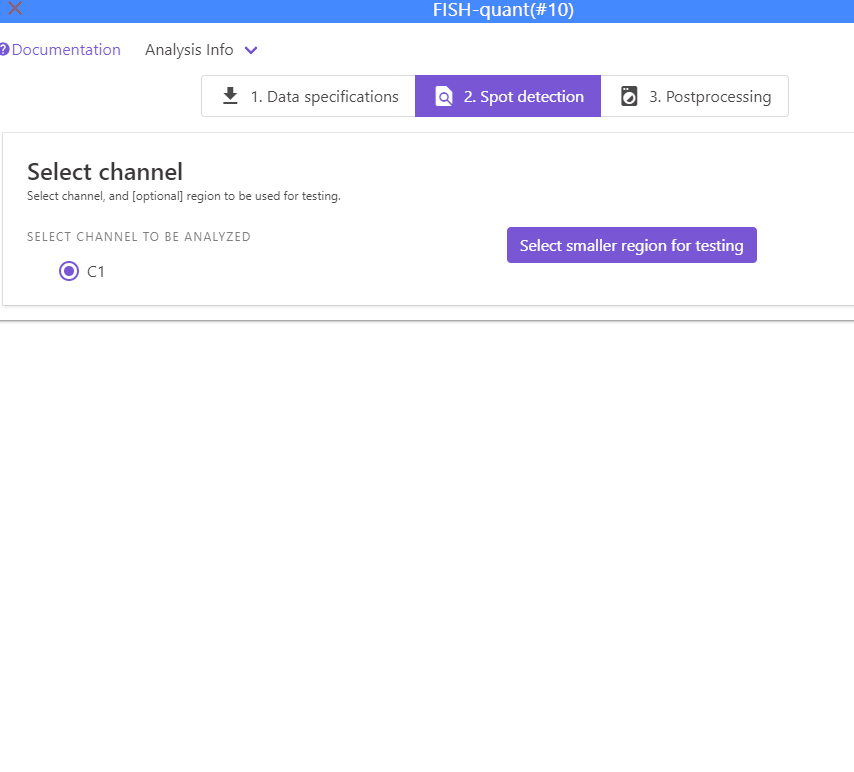

## Some background
Spot detection is performed with a standard spot detection approach on either 2D or 3D images.

1. Images are filtered with a Laplacian of Gaussian (Log) filter. This removes background and enhances local contrast of small spots. 
2. Spots are detected with a local maximum approach. As the name implies, spots are considered if they are above a user-defined threshold and further away from another spot than a user-defined distance. 

In this tab, the user will specify

* Parameters of the LoG filter
* Parameter of the local maximum detection: minimum distance and intensity threshold
* Apply this detection either to one image, or all images in the specified data folder. 

## Workflow
1. Select which channel should be analyzed.
2. [Optional]: to speed up an exploratory analysis, you can **restrict the analysis to a smaller region of the image**.
      1. Press `Select smaller region to test analysis`
      2. This will open a new window where you can draw a rectangular selection. 
      3. Once you are satisfied with the selection, highlight the rectangle (it will turn red) and press on the return button in the upper right corner. 
      
      {: style="width:450px"}
      
3. **Filter image**. Here you can change the paramaters of the LoG (Laplacian of Gaussian filter).
   Filtered image will be shown in the interface. 
   
   * **Double click** on the image will show it in a separate interface for inspection. This interface can not be resized and has to be closed before continuing the analysis. See dedicate [section](imjoy-imageviewer.md) for more details on how to use the image viewer.
   * To show the image in a interface that can be resized and kept open, press the button button `Show`.
   * You can **save** filtered image on the disk with the button `Save`. It will saved in a subfolder `filtered_image`.

4. **Establish detection thresholds**. This will be performed on the filtered image. 
   
    1. You can specify a minimum distance two spots have to be separate in order to be considered separate spots (default 2 pixels)
    2. You can specify a range of detection tresholdsthat will be test to help establishing a good threshold. In the pull-down menu you can set how many intensity values will be tested between the specified  minimum, maximum value. 
    To properly set this range, it can be useful to inspect the filtered image and 
    establish the typical intensity range of spots that should be detected. We recommend using a min value a value close to background, and as max a value
    brighter than the brightest spot.

        {: style="width:350px"}

    1. Pressing `Test thresholds` will calculate for each threshold the number
       of detected spots and show this as a graph. 
         * This plot is interactive. When you hoover over it
           it will show you the corresponding values, you can also zoom, and save it as an image. 
         * When you press on it, the respective threshold will be set
           in the field next to the button `Apply detection threshold`

        {: style="width:350px"}
    
    2. To apply the threshold, press the button `Apply detection threshold`. Once finished, 
        this will show the results in a separate window, where the spot detections can be toogled and the 
        image contrast be changed. 

        {: style="width:350px"}

    3. You can then analyze either
        * The **currently selected image** with the button `Analyze current image`. If filtering was performed was on the full size image, the image will not be filtered again. 
        
        This will also automatically save the plot with the tested thresholds in addition to the results files with the suffix `__detection_tests.png`.
        * All **images in the folder** with the button `Launch batch processing`
        For each analysed images, results files will be created in the specified results folder. 
        More details on the results files can be found below. 

## Results
For each analyzed image, two files will be created and stored under the orginal image name with a suffix

* `**__settings.json`: file with all analysis settings. 
* `**___spots.csv`: csv file with the position of all detected spots (in pixel). 

