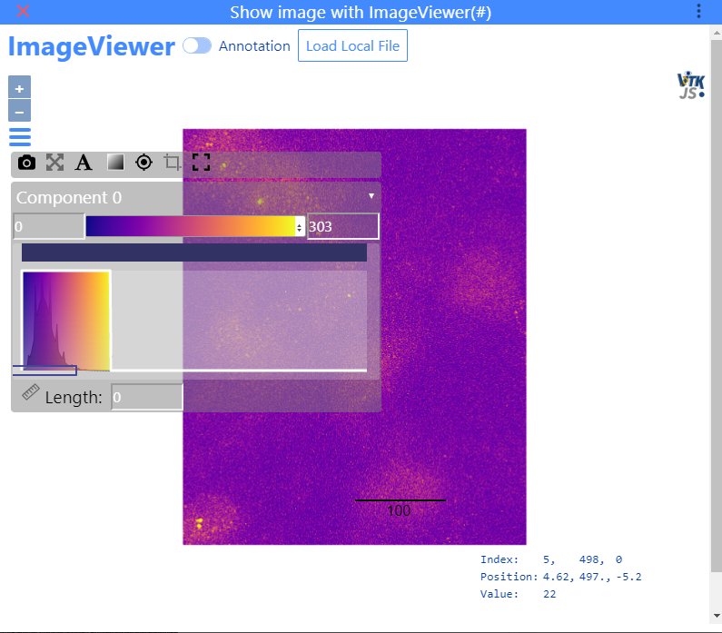

For interactive inspection of the image and the detection results,
FISH-quant used the ImageViewer of ImJoy. It uses

* [VTK](https://vtk.org/) for image display
* [Openlayers](https://openlayers.org/) to display spot detection results. 

{: style="width:500px"}

## Inspection of your image
Once your image is opend, you can interact with your image. 

__Navigate__:

* When **hoovering** over a pixel you will see relevant information such as its position and importantly intensity value.
* **Zoom** either with the dedicated buttons, or with the mouse-wheel, or gestures on touch-screens.
*  **Pan** with pressed mouse button, or corresponding gestures on a touch screen. 

__Appearance__:

Pressing on the vertical bars, will open a Dashboard that allows you (among other things)

* Change the **lookup table**.
* Change the **contrast of the image**.
* Take a **snapshot** that will be shown in a new browser tab.