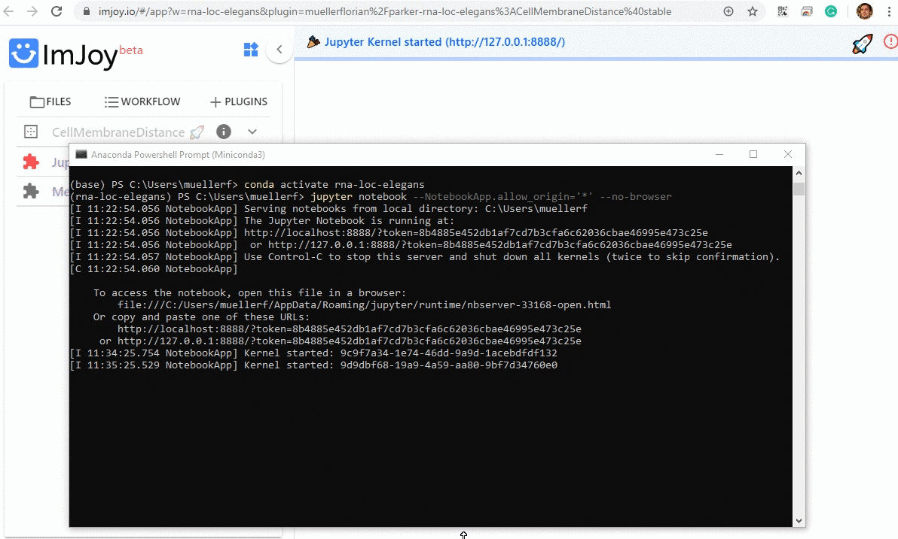

# ImJoy plugin engine

Most of the provided plugins use Python for data processing. To use these plugins, 
you have to connect ImJoy to a Plugin engine. For this repository, we use **Jupyter notebooks** as 
and engine, which can be installed via Miniconda (see installation instructions below [below](#install-jupyter-engine-for-imjoy)). 

## Install Jupyter engine for ImJoy

This you only need to do **once**.

We recommend installing [**Miniconda** with Python](https://docs.conda.io/en/latest/miniconda.html): 
choose latest Python version (3.X) and your operating system. You  can then use the annoconda prompt 
to excecute the commands listed below. 

We recommend creating a **dedicated environment** to run code in this analysis package. To create an environment called `fq-imjoy`, open an anaconda prompt and type (Confirm with `y` when asked if you want to proceed (`Proceed ([y]/n)?`):

``` bash
conda create --name fq-imjoy python=3.7
```

**Activate the environment**:

``` bash
conda activate fq-imjoy
```

**Install code Jupyter optimized for ImJoy**:

``` bash
pip install -U imjoy
```

## Connect Jupyter engine

Once installed Jupyter is installed, you can start a Jupyter Notebook in the anaconda terminal, 
to which ImJoy can connect.

* Please note that this engine runs on your local machine, so no data-transfer over the internet is taking place. 
* In order to connect a Jupyter engine, you need to specify its url that also contains a token (a passphrase). 
    If you launch a Jupyter notebook for the first time, you have to provide this URL to ImJoy
    (indicated below with **First time only**). After this, ImJoy will remember it. 


1. Launch a **Jupyter Engine for ImJoy**:

    1. Start an **anaconda terminal**. 
    2. **Activate the environment**: `conda activate fq-imjoy`
    3. **Start Jupyter engine**: `imjoy --jupyter`
    4. **First time only**: copy the provided URL including the token, 
        e.g. `http://127.0.0.1:8888/?token=8b4885e452db1af7cd7b3cfa6c62036cbae46995e473c25e`

2. **Connect ImJoy to Jupyter Engine**:

    1. In the ImJoy app, press on the rocket symbol in the upper right corner.
         * **First time only**: select `Add Jupyter-Engine`, paste the URL from the step above, and you can give a new name to the engine
         * **Subsequent use**: press on the pre-defined plugin engine to connect to it (of course you have to launch it first).

3. If this is the only engine, plugins will be **automatically connected**. You can verify this, 
   by clicking on the puzzle symbol next to the plugin name. Depending on the plugin, installation
   might take a while, during this period the plugin name will be in red.  

    If yoy have multiple engines, you have to choose on which engine the plugin should be running 
    (more details [below](#plugin-running-on-wrong-engine)).

   

### Managing plugin engines

ImJoy remembers the plugin engines it connected to (including the token). You can obtain the list of all
registered engines by pressing on the rocket symbol.

{: style="width:300px"}

* **Connected engines** will be shown with their name in black, and a red cross next to the name. Pressing the cross will disconnect ImJoy from the engine, but it will remain in the list.
* **Known engines** (but not connected) will be shown with their name in gray, with a little trash symbol next to them. Pressing on the trash symbol will remove the engine.

