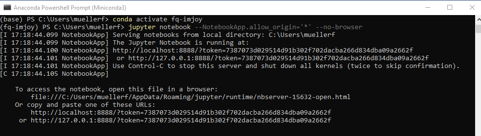

# ImJoy plugin engine

Most of the provided plugins use Python for data processing. To use these plugins, 
you have to connect ImJoy to a Plugin engine, which can be installed via Miniconda.

If you install this engine as explained below, it runs on your local machine, so **no data-transfer over the internet is taking place**.

## Install plugin engine

This you only need to do **once**.

We recommend installing [**Miniconda** with Python](https://docs.conda.io/en/latest/miniconda.html). Choose latest Python version (3.X) and your operating system. 

You  can then use the **annoconda prompt** to excecute the commands listed below

* Windows: From the Start menu, search for and open "Anaconda Prompt."
* MacOS: Open Launchpad, then click the terminal icon.
* Linux: Open a terminal window

We recommend creating a **dedicated environment** to run code in this analysis package. Having a dedicated environment, increases stability of the code by reducing possible conflicts with other installed packages. To create an environment called `fq-imjoy`, open an anaconda prompt and type:

``` bash
conda create --name fq-imjoy python=3.7
```

Confirm with `y` when asked if you want to proceed (`Proceed ([y]/n)?`).

**Activate the environment**:

``` bash
conda activate fq-imjoy
```

**Install code Jupyter optimized for ImJoy**:

``` bash
pip install -U imjoy[jupyter]
```

## Connect ImJoy to engine

Once installed the engine is installed, you can start it an connect ImJoy to it.

1. **Launch engine**
    1. Open **anaconda terminal**.
    2. **Activate environment**: `conda activate fq-imjoy`
    3. **Start Jupyter engine**: `imjoy --jupyter`. Copy the provide URL+token (see screenshot below).

        

2. **Connect ImJoy to Jupyter**: in the ImJoy app, press on the rocket symbol 🚀 in the upper right corner. 
      * **First time only**: select `Add Jupyter-Engine`, paste the URL from the step above, e.g. `http://127.0.0.1:8888/?token=8b4885e452db1af7cd7b3cfa6c62036cbae46995e473c25e`,
        and you can give a new name to the engine
      * **Subsequent use**: press on the pre-defined plugin engine to connect to it (of course you have to launch it first).
        

Please note that you can connect ImJoy to multiple engines, e.g. to run different analysis workflows. 

### Manage engines

ImJoy remembers the plugin engines it connected to (including the token). You can obtain the list of all
registered engines by pressing on the rocket symbol.

{: style="width:300px"}

* **Connected engines** will be shown with their name in black, and a red cross next to the name. Pressing the cross will disconnect ImJoy from the engine, but it will remain in the list.
* **Known engines** (but not connected) will be shown with their name in gray, with a little trash symbol next to them. Pressing on the trash symbol will remove the engine.

## FAQ

### Plugin running on wrong engine

You have several options

* Disconnect or delete the engine the plugin is connecting to see [here](#managing-plugin-engines)).
* In the plugin menu (clicking on the little puzzle symbol left of the plugin name), select the appropriate engine.

### Remove conda environment

At one point, your conda environment might get corrupted. You can easily remove it, and create a new one

1. Open anaconda terminal
2. **Activate base environment**: `conda deactivate`
3. **Remove `fq-imjoy` environment**: `conda env remove --name fq-imjoy`


### Specify your own Jupyter token

You can specify your own token `yourtoken`

``` bash
imjoy --jupyter --token yourtoken
```

When launched like this, you will not get the full Jupyter URL in the terminal, but `http://localhost:8888/?token=...`.

When copying this link to the ImJoy app for the first time you have to replace the `...` by the token you actually specified.

The next time you start jupyter with `imjoy --jupyter` your custom token will be used.
