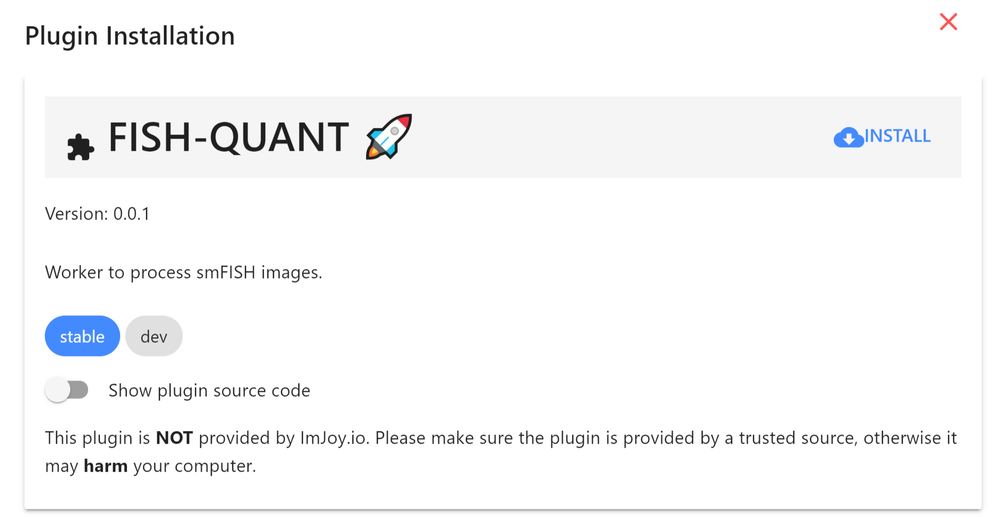

# ImJoy

[ImJoy](https://imjoy.io/docs/#/) is image processing platform with an easy to use interface running in your browser.  

* While ImJoy is a browser app, **NO** user data will be transferred over the internet. 
* For best stability, we recommend using [**Chrome**](https://www.google.com/chrome/) to run the ImJoy app.  
* Some of its main **features** are:

    1. Specific functionality is provided by **plugins**, which can be installed with simple links. Available 
        plugins are listed in the plugin list on the left part of the interface. Plugins using Python require a Plugin engine to be executed. Installation and usasage is detailed below.  

    2. ImJoy can have several **workspaces**. Each workspace can contain multiple plugins and is 
        dedicated to a specific data processing task. Workspaces can be selected from little puzzle 
        symbol in the upper left part of the interface.

## Connect ImJoy to the plugin engine

Once you have the ImJoy plugin engine installed (instructions see below), you can connect to it with this easy steps:

!!! abstract "Connect ImJoy to Jupyter engine."
    1. Open **anaconda terminal**. 
    2. **Activate environment**: `conda activate fq-imjoy`
    3. **Start Jupyter engine**: `imjoy --jupyter`
    4. **Connect** ImJoy app to Jupyter Engine with 🚀 button.

## Installing plugins

We provide links to install ImJoy plugins for the different workflows. 

If you press on the installation link, the ImJoy app will open and display a
dialog asking if you want to install the specified plugin. To confirm, press 
the `install` button.

{: style="width:400px"}

These installation links also specify in which [ImJoy workspaces](tools-imjoy.md#opening-a-workspace) the plugin will be installed. 

## Opening a workspace

Once a plugin is installed, ImJoy remembers the workspaces and plugins it contains. 

If you want to redo an analysis, you simply have to open the [ImJoy app](https://imjoy.io/#/app) 
and select the workspace `fq-main` for this package. 

If **updates** for the installed plugins 
are available, you will see a corresponding symbol next to the plugin name.

{: style="width:500px"}
