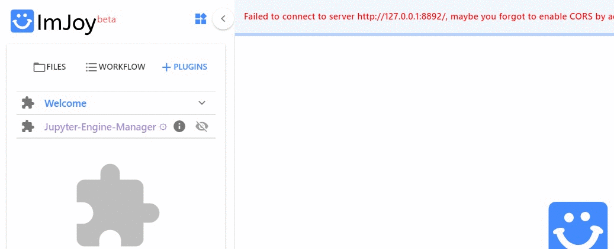

# ImJoy
[ImJoy](https://imjoy.io/docs/#/) is image processing platform with an easy
to use interface. ImJoy can be used directly in your browser, without any prior installation. 

 While ImJoy is an app running in the browser, **NO** user data will be transferred over the internet. 
 
 Some important **features**:

 2. Specific functionality is provided by **plugins**, which can be installed with simple links. Available 
    plugins are listed in the plugin list on the left part of the interface. Depending on the implementation 
    plugins are either executed directly by pressing on their name, or a simple interface can be displayed when
    pressing on the arrow down symbol. 
 3. ImJoy can have several **workspaces**. Each workspace can contain multiple plugins and is often
    dedicated to a specific data processing task. Workspaces can be selected from little puzzle symbol in the upper left part of the interface.
 
    

## Installing plugins
We provide links to install ImJoy plugins for the different workflows. 
These installation links also specify in which **ImJoy workspaces** the plugin will be installed  

If you press on the installation link, the ImJoy web app will open and display a
dialog asking if you want to install the specified plugin. To confirm, press 
the `install` button.

Once installed, ImJoy remembers the workspaces and plugins and you simply have to
open the ImJoy app and select the workspace you want to use (which will be `fq-imjoy`) 
[https://imjoy.io/#/app](https://imjoy.io/#/app)

## Running Python plugins 
Most of the provided plugins use Python for the processing. In order for ImJoy these plugins, you have 
to connect ImJoy to a **Jupyter notebook**, which can be installed via Miniconda (see section about [ImJoy and Jupyter](#imjoy-jupyter)). 

