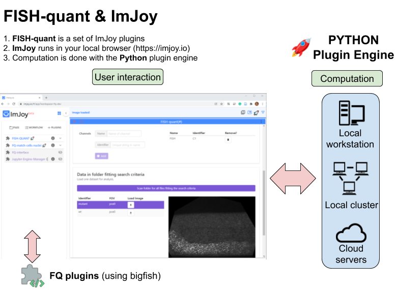
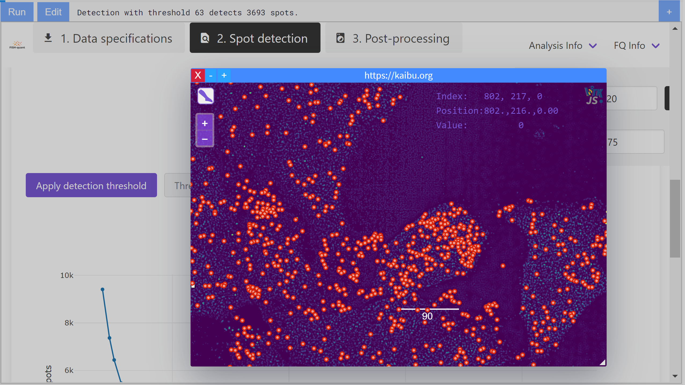

# RNA detection in smFISH images with ImJoy

This repository contains code for graphical user-interfaces powered by ImJoy
to analyse smFISH images with our Python analysis package `big-fish`. 

!!! info "Getting started."
    1. Read this documentation.
    2. Install the ImJoy plugin engine (we explain what this is just a bit further down).
    3. Install the FISH-quant plugins.
    4. Try to analyze the provided test data either with our interactive documentation (see below) or a local installation.

## ImJoy? Big-FISH? Plugin engine?

There are a number of different components that work together, which might be a bit confusing. Below you
can find a smaller overview, they will be presented in more detail in the documentation:  

{: style="width:500px"}

There are three  essential parts:

* **ImJoy**: ImJoy is a plugin powered [computing platform](https://www.nature.com/articles/s41592-019-0627-0) to deploy advanced image analysis tools. FISH-quant is implemented as a set of such plugins. Plugins can be installed with a simple installation link. More details about ImJoy and how it can be installed, can be found in the decicated overview section.
* **Plugin Engine**: the ImJoy app is running in your webbrowser (prefereably Chrome) and provides the user-interface. In order to perform computations, you have to install the
so-called plugin engine which runs Python (only once). When you use FISH-quant, you have to launch this engine and can connect ith with ImJoy. 
* **big-fish**: Python code performing the actual analysis (available in a dedicated [GitHub repository](https://github.com/fish-quant/big-fish). This package can be used to build your own analysis pipeline, but here we provide convient user-interfaces implemented in ImJoy for the most common tasks.
  
## Interactive documentation

If you want to get a feeling for how the interface looks like and what kind of analysis you can do, 
check out our interactive documentation [**here**](https://fish-quant.github.io/fq-interactive-docs/#/fq-imjoy).

You can run an analysis without any local installation on some provided demo data. We also provide a quick run-down
for you to use the toll, so that you can get starte quickly. If you like what you see, you can install a local version as explained in 
this documentation and process your own data. 

{: style="width:500px"}