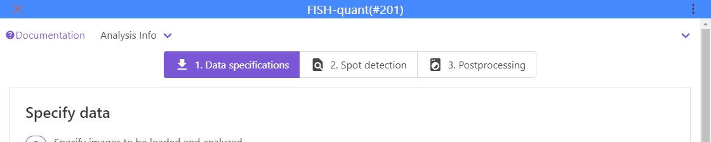

# FISH-quant: RNA detection in smFISH images

This repository contains code for graphical user-interfaces powered by ImJoy
to analyse smFISH images. 

__How to get started:__

1. Read this documentation.
2. Install the ImJoy plugin engine (we explain what this is just a bit further down).
3. Install the FISH-quant plugins.
4. Try to analyze the provided test data.

## FISH-quant? ImJoy? Plugin engine?

For new users it might be a bit confusing how the different software packages work together. 
We hence provide here a small overview of hwo the different pieces work together. 

There are three  essential parts

{: style="width:500px"}

* **bigfish**: Python code performing the actual analysis (available in a dedicated [GitHub repository](https://github.com/fish-quant/big-fish. This code can be used from the command line, but we here we provide convient user-interfaces implemented in ImJoy for the most common tasks. 
* **ImJoy**: ImJoy is a plugin powered computing platform to deploy advanced image analysis tools. FISH-quant is implemented as a set of such plugins. Plugins can be installed with a simple installation link. More details about ImJoy and how it can be installed, can be found in the decicated overview section.
* **Plugin Engine**: the ImJoy app is running in your webbrowser (prefereably Chrome). In order to perform computations, you have to install a 
so-called plugin engine. ImJoy can connect to such an engine, and launch data processing tasks. Importantly, this engine can run locally or remotely, but the ImJoy interface will always be the same. YOu have to install this engine once. Each time you want to use FISH-quant, you have to launch it and connect ImJoy to this engine.

## Summary: connect ImJoy to the plugin engine

!!! abstract "Summary for how to connect ImJoy to Jupyter engine. Details in dedicated sections."
    1. Open **anaconda terminal**. 
    2. **Activate environment**: `conda activate fq-imjoy`
    3. **Start Jupyter engine**: `imjoy --jupyter`
    4. **Connect** ImJoy app to Jupyter Engine with 🚀 button.

## Reporting bugs

If you encounter a bug, best is to create a [**GitHub issue**](https://github.com/fish-quant/fq-imjoy/issues). This would allow other users to see 
reported bugs and proposed solutions. An issue template is provided indicating information that is ideally provided to more quickly identify the potential reason causing a bug, 
please provide the following information.

1. **How** can bug be produced?
2. Which **browser** and version are you using?
3. **Version of the FISH-quant plugins**. They can be obtained from within the interface

    {: style="width:600px"}

4. **Plugin log**. Can be obtained by clicking on the `i` next to the FISH-QUANT plugin. Please copy to a text file. 
5. **Console log**. The console log of the browser provides further details that can help for debugging. To acces the console log in **Chrome**:

      1. In the ImJoy app mouse-right-click.
      2. Select `Inspect`.
      3. This will open a new interface on the right size of your browser windows. Select the panel `Console` and copy the entire content, and paste it to a file.  

## Development team

* Florian Mueller. [Github](https://github.com/muellerflorian).
* Arthur Imbert. [GitHub](https://github.com/Henley13).
* Wei Ouyang. [Github](https://github.com/oeway).
* Thomas Walter. [Github](https://github.com/ThomasWalter).