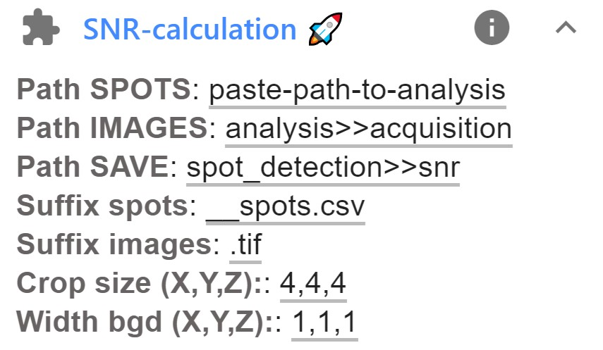

# Signal-To-Noise (SNR calculation)

__IMPORTANT__: currently only 3D images are supported.

To judge the quality of smFISH image, calculation of the 
SNR can be useful. This compares the signal (above background) to 
local background flucutations.

Plugin is available <a href="https://imjoy.io/#/app?w=fq-main&plugin=fish-quant/fq-imjoy:SNR-calculation@stable&upgrade=1" target="_blank">**here.**</a> 

Here, we provide an ImJoy plugin that calculates the **SNR** for each detected
spots. In short, the plugin extracts a small 3-d volume aroundthe detected spot. 
From this volume signal (`I`) is determined as the maximum pixel intensity. The outer most
layer(s) are used to calculate background (`B`) as the mean intensity,
and noise (`N`) as the standard deviation. The signal-to-noise ratio (`SNR`)
is then calculated as `SNR = (I-B)/N` for each spot.

## Usage

You first have to detect spots in your images. Then you can use the SNR plugin:

{: style="width:250px"}

1. Before running the plugin, you have to **specify a few parameters**. This can be done in the plugin interface, 
    avaible after clicking on the arrow down next to the plugin name.

    Here the following parameters can be set:

    Option           | Type |  Description
    ---------------- | ---- |  -----------
    `Path SPOTS`    | str  |   Full path to folder containing data to be segmented.
    `Path IMAGES` | str  |   Path to images. Several options exist. See dedicated section [below](snr.md#specify-folder-to-save-your-data) for more details.
    `Path SAVE` | str  |   Path to images. Several options exist. See dedicated section [below](snr.md#specify-folder-to-save-your-data) for more details.
    `Suffix spots`    | str  |  Last part of the file-names of the spot detection results (`__spots.csv`). This part has to be replaced with suffix_images to obtained the name of the images.
    `Suffix images`    | str  |   Last part of file-name of the images. See suffix spots.
    `String img ext`     | str  |  File extension of images that should be segmented.
    `Crop size`     | int  | Size of the region cropped around each spots (XYZ). Values are separated by `,`.
    `Width bgd`    | str  |  Widht of the background region, e.g. thickness of outer layer that is used as background. 
2. Pressing on the plugin name `SNR-calculation` will start the SNR calculation.
3. Results will be stored in the specified folder, by default this folder will be called `snr`. Here a file for each processed spot-detection result
   is saved. For each spots, the SNR, signal, background and noise are stored. Lastly, a summary file with all these values is provided. 

## Specify folder to save results

Several possibilities are provided to specify the folder to save the results of the different workflows. Here, the general options are described, if
a plugin deviates from this default behavior it will be described in the respective plugin.

When asked to define a folder to save results, you can:

1. Directly define a **full path** where the results should be stored. If the folder doesn't exist, it will be created.
2. Define a folder with a **text replacement**. This option can be useful if many folders are processed, e.g. when a recursive search is performed.

    * Such a replacement operation is indicated with a string in the format  `str_orig>>str_new`,
      where 'str_orig' is the orginal string, `str_new` is the new string.
    * For instance, using the string `analysis>>acquisition` implies that in the folder name
      `D:\example_data\acquisition`,  `acquisition` will be replaced with `analysis`, yielding `D:\example_data\analysis`.