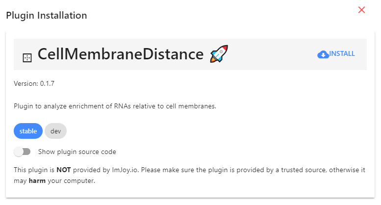
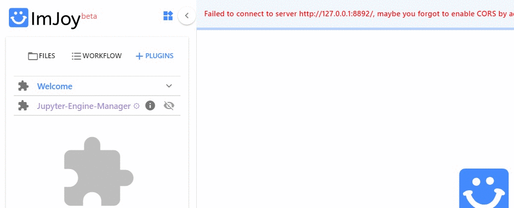
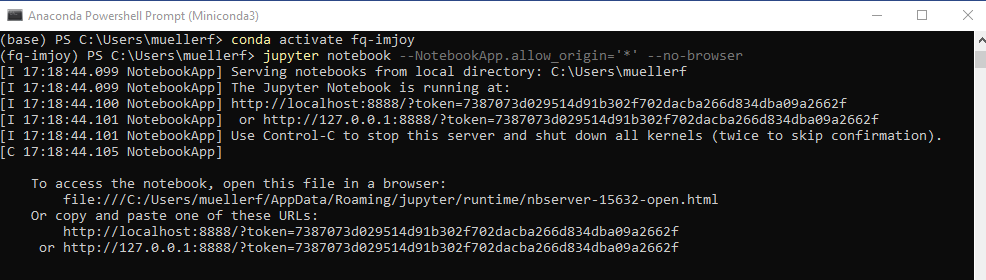
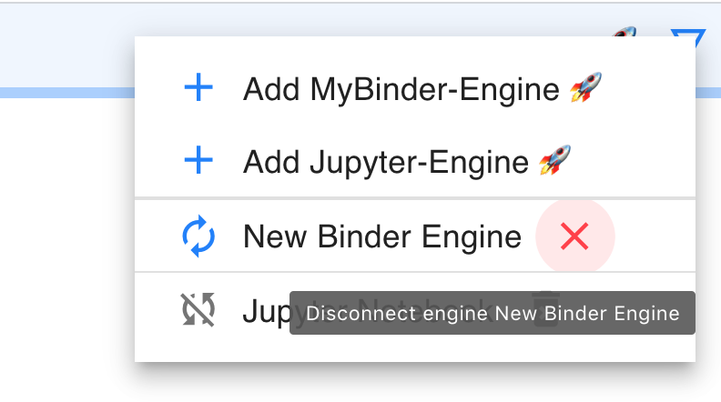

# ImJoy

[ImJoy](https://imjoy.io/docs/#/) is image processing platform with an easy to use interface running in your browser.  

* While ImJoy is a browser app, **NO** user data will be transferred over the internet. 
* For best stability, we recommend using [**Chrome**](https://www.google.com/chrome/) to run the ImJoy app.  
* Some of its main **features** are:

    1. Specific functionality is provided by **plugins**, which can be installed with simple links. Available 
        plugins are listed in the plugin list on the left part of the interface. Plugins using Python require 
        a Plugin engine to be executed. Installation and usasage is detailed below.  

        !!! abstract "Quick summary for how to connect ImJoy to Jupyter engine"
            1. Open **anaconda terminal**. 
            2. **Activate environment**: `conda activate fq-imjoy`
            3. **Start Jupyter engine**: `imjoy --jupyter`
            4. **Connect** ImJoy to Jupyter Engine 🚀.

    2. ImJoy can have several **workspaces**. Each workspace can contain multiple plugins and is 
        dedicated to a specific data processing task. Workspaces can be selected from little puzzle 
        symbol in the upper left part of the interface.


## Basic usage

### Installing plugins
We provide links to install ImJoy plugins for the different workflows. 
These installation links also specify in which **ImJoy workspaces** the plugin will be installed  

If you press on the installation link, the ImJoy web app will open and display a
dialog asking if you want to install the specified plugin. To confirm, press 
the `install` button.

{: style="width:400px"}

### Opening a workspace
Once a plugin is installed, ImJoy remembers the workspaces and plugins it contains. 
If you want to redo an analysis, you simply have to open the [ImJoy app](https://imjoy.io/#/app) 
and select the workspace `fq-main` for this package: 

{: style="width:500px"}


## Running Python plugins 
Most of the provided plugins use Python for data processing. To use these plugins, 
you have to connect ImJoy to a Plugin engine. For this repository, we use **Jupyter notebooks** as 
and engine, which can be installed via Miniconda (see section about Python Installation [below](#jupyter-for-imjoy)). 

### Connect Jupyter engine

Once installed Jupyter is installed, you can start a Jupyter Notebook in the anaconda terminal, 
to which ImJoy can connect. 

* Please note that this engine runs on your local machine, so no data-transfer over the internet is taking place. 
* In order to connect a Jupyter engine, you need to specify its url that also contains a token (a passphrase). 
    If you launch a Jupyter notebook for the first time, you have to provide this URL to ImJoy
    (indicated below with **First time only**). After this, ImJoy will remember it. 



1. Launch a **Jupyter Engine for ImJoy**:
   
    1. Start an **anaconda terminal**. 
    2. **Activate the environment**: `conda activate fq-imjoy`
    3. **Start Jupyter engine**: `imjoy --jupyter`
    4. **First time only**: copy the provided URL including the token, 
        e.g. `http://127.0.0.1:8888/?token=8b4885e452db1af7cd7b3cfa6c62036cbae46995e473c25e`
        
 
2. **Connect ImJoy to Jupyter Engine**: 
   
    1. In the ImJoy app, press on the rocket symbol in the upper right corner.
         * **First time only**: select `Add Jupyter-Engine`, paste the URL from the step above, and you can give a new name to the engine
         * **Subsequent use**: press on the pre-defined plugin engine to connect to it (of course you have to launch it first).

3. If this is the only engine, plugins will be **automatically connected**. You can verify this, 
   by clicking on the puzzle symbol next to the plugin name. Depending on the plugin, installation
   might take a while, during this period the plugin name will be in red.  

    If yoy have multiple engines, you have to choose on which engine the plugin should be running 
    (more details [below](#plugin-running-on-wrong-engine)).

   


### Managing plugin engines
ImJoy remembers the plugin engines it connected to (including the token). You can obtain the list of all
registered engines by pressing on the rocket symbol. 

{: style="width:300px"}

* **Connected engines** will be shown with their name in black, and a red cross next to the name. Pressing the cross will disconnect ImJoy from the engine, but it will remain in the list. 
* **Known engines** (but not connected) will be shown with their name in gray, with a little trash symbol next to them. Pressing on the trash symbol will remove the engine. 


## Installing Jupyter for ImJoy
We recommend installing an [Miniconda distribution of Python](https://docs.conda.io/en/latest/miniconda.html): 
choose Python 3.7 and your operating system. You  can then use the annoconda prompt to excecute the different commands listed below. 

We further recommend creating a **dedicated environment** to run code in this analysis package. 
This guarantess that only necessary code is installed. 
To create an environment called `fq-imjoy`, open an anaconda prompt and type (Confirm with `y` when asked if you want to proceed (`Proceed ([y]/n)?`): 

```
conda create --name fq-imjoy python=3.7
```

**Activate the environment**:
```
conda activate fq-imjoy
```

**Install code Jupyter optimized for ImJoy**:
```
pip install -U imjoy
```

## FAQ

### Plugin running on wrong engine
You have several options

* Disconnect or delete the engine the plugin is connecting to (see )[here](#managing-plugin-engines)).
* In the plugin menu (clicking on the little puzzle symbol left of the plugin name), select the appropriate engine.


### Remove conda environment
At one point, your conda environment might get corrupted. You can easily remove it, and create a new one

1. Open anaconda terminal
0. **Activate base environment**: `conda activate base`
0. **Remove `fq-imjoy` environment**: `conda env remove --name fq-imjoy`


### Reporting bugs
Detailed installation logs are provided in the console of the browser. Information in this log, can facilitate the correction of encountered bugs. When reporting problems with this package, please provide the log copied to text file. 

To acces the console log in **Chrome**:

1. In the ImJoy app mouse-right-click. 
2. Select `Inspect`. 
3. This will open a new interface on the right size of your browser windows. Select the panel `Console` and copy the entire content, and paste it to a file.  

### Specify your own Jupyter token
You can specify your own token `yourtoken`

```
imjoy --jupyter --token yourtoken
```
When launched like this, you will not get the full Jupyter URL in the terminal, but `http://localhost:8888/?token=...`.

When copying this link to the ImJoy app for the first time you have to replace the `...` by the token you actually specified.

The next time you start jupyter with `imjoy --jupyter` your custom token will be used